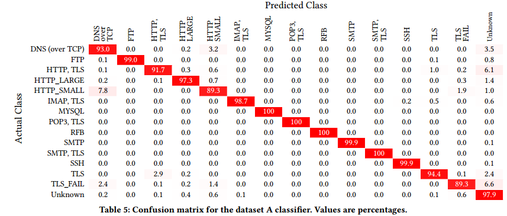

# GGFAST: Automating Generation of FlexibleNetwork Traffic Classifiers

## 摘要

在使用监督机器学习分析网络流量时，任务的核心往往在于开发出有效的特征供机器学习使用。我们开发了GGFAST，一个统一的自动化框架，可以构建针对特定网络流量分析任务的强大分类器，并基于可解释的特征。该框架仅使用包的大小、方向和顺序，从而能够在不考虑有效负载的情况下进行分析，即使在加密的情况下也适用。

GGFAST分析标记的网络数据，以识别网络流量中长度序列的n-grams（“片段”），这些片段对特定活动类别具有强烈的指示性。然后，该框架生成一个分类器，给定新的（未标记的）网络数据，通过评估与不同类别相关的片段的存在（或不存在）来识别每个流的活动。

我们通过构建——无需任何特定情况的调优——多个类型的网络分析任务的高精度分析器来展示我们框架的威力。这些任务包括流量分类（L7协议识别）、在TLS流中发现DNS-over-HTTPS，以及识别特定的RDP和SSH认证方法。最后，我们展示了在给定加密套件的情况下，如何将为特定类型流量开发的GGFAST分析器自动转换为检测在SSH或TLS中隧道传输的该活动实例。

## 1介绍

许多网络流量分析问题可以被视为分类任务：给定网络流的一组特征，决定将流分类到哪个类别。这些类别可以指不同语义层次的活动，例如确定流使用的应用协议，流内的特定使用模式（例如，确定SSH会话中的认证机制），或可能的攻击的存在。

给定一个包含每个流按类别标记的网络流量数据集，现代研究人员通常会使用某种形式的监督机器学习来开发一个分类器，旨在区分不同类型的活动。通常，任务的核心在于开发出有效的特征供机器学习利用。到目前为止的工作要么手工设计特征——需要大量努力——要么使用复杂的机器学习算法来补偿使用通用特征时的效果减弱。后者的方法往往缺乏可解释性：很难弄清分类器的规则是如何工作的，因此分类器可能表现出的泛化能力或缺陷也难以评估。

此外，网络流量活动的一个潜在非常丰富的信息来源——即给定流携带的第7层有效负载——既需要分类器从高速流量流中提取的成本昂贵，更根本的是越来越被加密所遮蔽。

此外，网络协议通常封装在加密层中。这对现有的分类器来说是一个痛点：标签是通过解密流量获取的，使用主机上的软件或中间人代理，这在大型组织中难以部署。由于这些复杂性，加密数据的标记稀缺，影响了分类器的质量。

这些考虑导致需要一种能够（1）自动从任何标记流量数据中生成适当特征集的方案；（2）无需访问应用负载；（3）构建简单且可解释的分类器；（4）能够在大规模网络上高效执行。最后，这种方案应当（5）从容易获取的数据中生成加密分类器——无需解密流量。

在这项工作中，我们开发了这样一个框架，基于以下假设：许多形式的网络活动反映了底层的、结构化的消息交换，其序列模式可能具有唯一性——前提是我们知道在哪里寻找，即上述（1）所需的特征工程。我们从四个主要设计目标出发：
- 适用于任何应用程序活动，我们可以获得协议元素长度的扩展标记示例，以获得一些一致的“元素”概念。这些长度可以反映数据包大小、套接字写入（应用程序 PDU）或 TLS 帧，只要每个示例使用相同的长度即可。
- 生成多标签分类器，做出可解释的、省时的决策，而不需要调整参数。我们设计了使用正则表达式匹配提取特征的方法(在时间上可线性执行，与输入大小无关，不考虑正则表达式的数量)，并采用高效的朴素贝叶斯分类器。
- 无需特定训练即可转移到加密分类任务。特别是，明文协议分类器可以确定性地修改为适用于相同协议的加密版本，最多只会有小幅准确性损失。
- 匹配或超过最先进的网络分类准确性。

我们的框架GGFAST自动识别消息模式使用标记的网络流量样本，利用这些构建概念上简单的网络活动分类器。受DNA分析技术启发，我们在包长度序列中识别常见模式，即“片段”。然后，我们使用片段的存在（或不存在），包括它们在网络流中的位置，作为特征来训练一个朴素贝叶斯分类器，将给定的流分类为特定类型的活动。

我们通过构建——无需任何特定情况的调优——多个类型的网络分析任务的高精度分析器来展示我们框架的威力：流量分类（L7协议识别）、TLS流中是否包含DNS-over-HTTPS，以及识别特定的RDP和SSH认证方法（如密码、口令、Kerberos）。我们的评估发现，GGFAST能够为每个问题生成高效的分类器，并且每个类别只需几千个样本。

最后，我们观察到用于增加加密保护的互联网协议本身通常使用高度结构化的消息序列，并且仅部分模糊了底层协议的长度。为此，我们展示了在给定加密套件的情况下，如何将为特定类型流量开发的GGFAST分析器自动转换为检测在SSH或TLS中隧道传输的该活动实例。

## 2相关工作

在为检测各种类型的网络活动（例如应用层协议、使用模式、异常）开发分类器方面，有大量的研究工作。大多数方法为作者提出独特的特征和决策算法定义了一个特定的分类任务。

一条广泛的研究线索涉及识别L7协议。最初，可以使用已知的传输端口号来识别应用协议，但这种方法的有效性随着时间的推移而减弱。研究人员随后开发了基于模式匹配或解析传输负载的技术。这些方法仍然是分析流量的高精度方式，但（1）需要对每个应用进行大量的手工努力，（2）在非常高速的链接上可能太昂贵，（3）无法应用于加密流量。

针对这些问题的研究采用了机器学习。尽管其中一些工作使用了行为方法，例如谁与谁通信的图，大多数方法使用统计概况或某种形式的长度序列信息。

### 统计概况
这些方法使用连接相关值的摘要统计来描述连接，通常包括包大小、方向和到达时间间隔，总体大小分布或应用DSP技术对长度和时间序列进行转换的特征。这种转换通常会产生大量特征集，阻碍了可解释性，并且其汇总性质无法利用细粒度信息，例如包大小的特定模式。

### 长度序列
另一主要研究方向集中在使用应用长度序列的特征。最简单的形式是使用前N个包的大小作为特征，例如【3, 8, 9, 20】。【48】声称使用前7个包的大小作为特征足以进行某些类型的分类。其他工作则设计了更能捕捉应用特定活动的基于长度序列的特征。【46】通过在固定时间间隔内寻找特定大小的包来识别简洁的指纹，代表每个流量类。【38】通过找到与未知样本共享最长公共子序列的标记样本，采用基于模式的方法进行流量分类。【55】通过寻找代表每个类的一组序列并计算每个新样本到这些代表的距离，将包长度用作签名。这三项研究中的技术概念上有希望，与我们的方法有相似之处，但迄今为止它们缺乏在大规模数据上的评估，最近的两项工作也没有讨论流量标记【38, 55】，这是构建鲁棒分类器的关键问题。

### 机器学习方法
上述许多方法最终都采用了监督机器学习。最近的出版物重点使用深度学习【1, 19, 35-37, 53, 58, 59, 62】，其优点在于选择自己的特征，但代价是可解释性较差。目前这方面研究的领先方法是nPrint【24】，通过定义标准的包向量表示来应用AutoGluon【18】机器学习框架。

一些研究人员还考虑了数据的半监督或无监督聚类【8, 9, 60, 68, 69】，可以识别未知应用的集群，但无法标记每个集群。

我们的框架在某种程度上类似于【38, 46, 55】，它们也集中在识别流量类中的独特结构。我们与这些工作的不同之处在于，它们集中在寻找完整流量的最接近匹配或在一段时间内计数特定包长度的出现次数，而我们则基于特定的包长度和范围序列来表征流量，这表明特定形式的活动。由于这些工作缺乏关于如何标记流量的信息，这些方法也难以评估。（该领域的其他工作特别旨在根据观察到的通信识别状态机【49, 61】，但依赖于包内容。）

最后，我们的框架旨在自动化，几乎不需要任何微调。最近关于构建自动化机器学习框架的工作涵盖了所有步骤，从特征提取到模型选择，三个值得注意的项目是AutoGluon【18】、深度特征合成算法【26】和“Ease.ML”【41】。这三者都可以从表格数据中构建有效的分类器，无需任何微调或特征工程。然而，这些是通用框架，不适用于分析序列网络数据。

其他研究直接在自动化机器学习用于网络分析的领域进行了研究。【5, 6】提出了一个基于统计概况特征的项目轮廓。【32】介绍了MalPaCA，一种使用12个特定头字段作为原始数据的自动化无监督聚类算法。【13】通过Zeek日志【47】衍生了一个自动特征工程框架，以识别HTTP隧道。【30】提出了一种构建电子邮件垃圾邮件检测器的自动方法。鉴于这些最新的工作，GGFAST可以被视为一个自动化特征工程和学习框架，从序列网络数据中工作，比表格流量统计更丰富的数据源。

### 3片段（Snippets）

我们方法的关键在于自动找到每类流量特征长度序列中的模式集。我们将L向量（L-vector）定义为长度和方向的序列。对于大多数流量，L向量是流中每个包的长度和方向的序列。我们可以使用不同的L向量变体来表示套接字写入大小或TLS应用数据负载长度，如第B节所述。

L向量中的模式可以反映状态转换信息或特定于应用的其他活动，我们可以利用这些模式来识别流量的本质。我们称这些模式为片段（snippets）。我们的框架旨在构建使用这些片段作为特征的分析器，以准确分类任意的TCP或UDP流量。此外，由于加密层（如TLS）通常将有效负载长度确定性地映射到密文长度，我们可以将明文协议中的基于长度的序列转换为它们的加密对应物，从而无需标记的加密数据即可将一组明文特征转换为加密特征。

我们将片段定义为一个三元组：（1）长度和长度范围的序列，（2）指定序列在L向量中位置的锚点，以及（3）一个潜在的否定标志，如果为真（用∉表示），则表明序列不应匹配（用∈表示则表明应匹配）。对于（1），我们使用一个装饰器表示消息的方向：→ 表示从流起始点（“客户端”）到响应者（“服务器”）的消息，← 表示相反方向的消息。对于（2），我们定义三种类型的锚点：
- 左锚定：在连接开始时从L向量的固定位置出现的片段（正锚点）。
- 右锚定：相对于L向量末端的固定位置出现的片段。
- 无锚定：在L向量中任何位置出现的片段（用锚值*表示）。

我们说一个片段匹配L向量，当长度序列出现在锚点指示的位置（未设置否定标志）；或者L向量不包含这样的序列（设置了否定标志）。我们还将片段的合取定义为一组全部匹配的片段。

例如，片段⟨{10→, 5←}, 0, ∈⟩匹配以长度为10的出站包开始，接着是长度为5的响应的L向量。
⟨{15→, [1←, ∞←), 10→}, −3, ∈⟩匹配以任何长度为15→, 𝑥←, 10→的序列结束的L向量，其中𝑥是服务器发出的任何非空消息长度；⟨{7→}, ∗, ∉⟩其否定标志已设置，因此它匹配不包含任何长度为7的客户端到服务器（“出站”）消息的L向量。

### 4 GGFAST 框架

找到能够有效区分活动类别的特征可能是一个挑战。例如，阅读POP3、IMAP和SMTP RFCs [11, 31, 44]并分析跟踪文件后，可能会发现片段⟨{6→}, −2, ∈⟩是明文电子邮件流量的一个良好识别器。然而，这个片段本身并不能完全代表所有的电子邮件流量，并且可能匹配与电子邮件无关的协议。

为此，我们的GGFAST框架为每个训练类构建一小组片段。如下图1所示，GGFAST工作分为六个步骤：
1. **分组**：通过量化为多个范围来离散化所有长度。
2. **收集片段**：从原始和离散化的L向量中收集片段。
3. **过滤冗余片段**。
4. **聚合**：形成多个片段的合取。
5. **选择**：选择覆盖每个类的一小组片段和合取。
6. **训练**：使用选定的片段集训练一个朴素贝叶斯分类器。

每一步都有其重要作用。分组允许考虑值的范围，这对于检测具有可变消息大小的应用至关重要。收集使我们能够构建一个在训练L向量中反复出现的候选片段的大列表。过滤移除冗余片段集，有助于确保我们选择一组高效的片段作为特征。（在我们的评估L向量中，这一步移除了超过80%的潜在片段。）聚合将多个原子片段（特征）组合成一个合取。由于L向量通常包含多个协议习语，它们可能会匹配多个特征片段。组合在同一L向量中经常出现的片段可以减少误报。（在我们的评估L向量中，这一步减少了最终片段数量的20%，并略微提高了总体准确性。）选择为每个类构建最终的特征片段集，旨在仅匹配给定类的L向量。  

  

这些步骤生成的特征集足够小，便于解释，具有每个类特定的行为特征，并且几乎是正交的，避免了冗余，从而实现了有效和高效的训练。

我们的框架支持生成两种类型的多标签分类器。第一种类型对𝑁个不同类进行预测。第二种类型使用𝑁+1个类：表示流量应用的𝑁个类，最后一个类由其他来源的流量组成（“未知”）。我们称这个最后的类为基线类。支持这个基线类为分类器的开发提供了灵活性，因为通常很难为大型活动网络收集的数据集中的所有流量标注标签。与其他类不同，基线类没有定义的片段集；当L向量不表现出任何类的足够片段时，流量分析器选择这个标签。

#### 4.1 分类背景

GGFAST通过片段集构建分类器。我们可以用特征向量表示流量：如果𝑆 = {𝑠𝑖}是分类器使用的片段集，𝑒是一个流的L向量，那么𝑓是指示特征的向量，使得𝑓𝑖 = 1当且仅当𝑠𝑖匹配𝑒。注意，L向量可以匹配多个片段，因此𝑓的任意数量的坐标都可以等于1。

评估片段𝑠作为区分类𝑐的特征的质量需要一个评分函数。我们选择使用类似于DNA分析中的位置权重矩阵（Position Weight Matrix）的日志评分，定义如下。设𝐶为流量类集，𝐷为训练数据集（L向量的集合），𝐷𝑐为标记为类𝑐的L向量集。我们定义𝑀(𝑠)，即匹配集，为由片段𝑠匹配的L向量集。我们考虑𝑀𝑐(𝑠) = 𝑀(𝑠) ∩ 𝐷𝑐，即类𝑐的匹配集，包含类𝑐的L向量；和𝑀𝑐
(𝑠) = 𝑀(𝑠) ∩ (𝐷\𝐷𝑐)，即所有其他类的L向量匹配集。

注意，我们可以用匹配集构建指示向量。如果𝐷𝑖是数据集𝐷中的第𝑖个L向量，我们可以定义𝑀(𝑠)𝑖为𝑀(𝑠)𝑖 = 1当且仅当𝑠匹配𝐷𝑖。

每个L向量有一个权重𝑊，表示它在训练集中出现的次数。我们记𝑊𝑐为类𝑐中所有元素的权重，记𝑊𝑐(𝑠)为类𝑐中由片段𝑠匹配的所有L向量的权重。然后我们定义类𝑐的片段评分score𝑐(𝑠)为：

\[\log\left(\frac{1+W_{c}(s)}{W_{c}}\right)-\log\left(\frac{1+\sum_{c^{*}\in C\setminus\{c\}}W_{c^{*}}(s)}{\sum_{c^{*}\in C\setminus\{c\}}W_{c^{*}}}\right).\]  

这个评分越大，片段就越具特征性，要么因为第一个项很大，意味着片段匹配了类𝑐的大部分数据集，要么因为第二个项很小，意味着片段匹配了很少的其他类元素。从概率上讲，这个评分是类𝑐的L向量对数似然比的平滑估计。根据Neyman-Pearson引理，将这个评分与固定阈值比较是决定L向量是否属于类𝑐的最优假设检验。

### 4.2 分组

GGFAST 的第一步是生成训练 L 向量的离散化版本。离散化将每个原始长度编码为一个类别，从而减少了可能值的基数。我们将长度编码为范围（而不是无序集合），因为这样做可以保留类别之间的自然顺序。在实践中，我们将每个原始长度替换为其所在范围（等效于“箱”）。例如，考虑一个 L 向量的编码 `{17←, 3→, 67←, 13→, 27→, 10←}` 和以下三个箱：
- A: `[1←, ∞←)`
- B: `[1→, 15→]`
- C: `[16→, ∞→]`

那么 L 向量将变为 `(A, B, A, B, C, A)`。除了减少可能值的数量，选择适当的箱可以帮助构建更显著的片段。由于每个流量类别（希望）具有不同的大小分布，我们可以设计包含某些类别更多元素的范围。通过这样做，使用这些范围构建片段将有助于识别每个类别的更适合的特征。

我们使用基于熵的离散化技术来生成原始 L 向量的范围，类似于 [21] 中使用的技术。首先，我们通过从每个序列中提取每个长度并将其与提取它们的序列的类别相关联，从现有数据集中构建一个新数据集。例如，如果我们的数据集 `D` 是 `{{10←, 5→}, {15←, 5→}, {10→, 20←}}`，且类别向量 `C` 是 `{Ca, Cb, Ca}`（即一个给出多个 L 向量关联类别的向量），则离散化数据集将是 `D* = {10←, 5→, 15←, 5→, 10→, 20←}` 和 `C* = {Ca, Ca, Cb, Cb, Ca, Ca}`。

从这个新数据集中，我们记 `ρc` 为反映类别 `c` 的这些 L 向量的比例。然后我们使用香农熵计算 `S = −∑c∈C ρc log(ρc)`。例如，箱 `[1→, ∞→)` 包含 `{5→, 5→}`，其相应类别为 `{1, 0}`。然后每个类别的比例为 0.5，因此此箱的熵为 `log(2) ≈ 0.3`。在多箱设置中，由于这些箱划分了样本空间，总熵是各个熵的加权平均，权重为每个箱中的样本比例。

箱的熵与每个箱内各类别的元素比例直接相关。具有类别失衡的箱将具有较低的熵；我们希望通过降低整体熵来找到有助于隔离某些类别成员的箱。因此，我们的目标是最小化熵。我们使用 [21] 中的技术通过迭代找到最佳箱以最大化旧配置和新配置之间的熵损失（等效于信息增益）。我们重复此过程，直到信息增益低于某个阈值（记为 `γ`），之后我们认为离散化已经充分分离了类别。我们在 § 4.8 中讨论了对 `γ` 的选择。

  

有了这个工具箱的功能，我们现在可以生成数据集的两个版本：原始的、未处理的 L 向量；以及编码版本。使用这两个版本使随后的分析能够利用更丰富的片段集合。本着这种精神，我们生成了两个额外的版本，以适应各种类型的协议：
- 某些流量类别可能主要在流量的一个方向上具有特征行为。我们生成单向编码，在该编码中我们仅通过算法处理给定方向的消息，同时将相反方向分配给一个大箱。
- 某些流量可能仅通过流量方向的顺序来表征。对于这些情况，我们还生成了一个特殊编码，仅使用两个箱：一个传出（客户端到服务器）箱和一个传入（服务器到客户端）箱。

总共，通过组合这些变体，我们最终得到了原始 L 向量的 5 个不同版本，如表 1 所示。如果我们必须手动筛选所有片段，处理所有这些变体将会非常繁琐，但这样做使我们的自动算法有机会识别出高度多样化的可能性，从而增加找到明显特征片段的机会。

### 4.3 聚集

聚集步骤旨在找到不同类别的潜在指示片段。我们筛选分组阶段产生的多个变体，以捕获不同粒度的锚定和未锚定片段。在此阶段，我们生成了数万条候选片段，这些片段将在算法的后续阶段进行精炼和筛选。我们在附录 A.1 中提供了更多有关聚集程序的详细信息。

### 4.4 筛选

前一步骤的输出提供了丰富的信息，但也包含许多冗余：捕获相同样本集的两个（或多个）片段。冗余可能由于多种原因而发生：
- 从 L 向量开始的恒定偏移处的特征模式将生成与该模式相关联的锚定左片段和未锚定片段。
- 一个模式可能在多种编码中显着，这将导致多个片段使用不同的编码捕获相同的特征。
- 片段通常是其他片段的子集。例如，如果类别的显著特征是最后两个数据包大小为 `6←`，则上一步可能会产生以下三个片段：`⟨{6←}, −2, ∈⟩`、`⟨{6←}, −1, ∈⟩`、`⟨{6←, 6←}, −2, ∈⟩`。

我们的筛选过程旨在去除这些冗余。对于与同一类别 `c` 相关的片段，我们定义了两个关系运算符，`⪯c` 和 `~c`。使用 § 4.1 中的符号，对于片段 `s` 和 `s'`：
- `s' ⪯c s ⇔ W(Mc(s) ∩ Mc(s')) ≥ δ × W(Mc(s')) ∧ W(Mc(s) ∩ Mc(s')) ≥ δ × W(Mc(s))`
- `s' ~c s ⇔ s' ⪯c s ∧ s ⪯c s'`

这里，`δ` 是相似度比参数（在 § 4.8 中进行了探讨），使我们能够改变集合之间的接近概念：值为 1 表示我们寻求确切的对应，因此 `δ = 1` 的等价性意味着片段捕获完全相同的集合。低于 1 的值允许集合之间存在小的差异。

直观上，我们说 `s` 大于 `s'` 当 `s` 捕获的大多数类内匹配项由 `s'` 捕获（即两个匹配集的交集的权重大约等于 `s'` 的匹配集），相反，`s` 捕获的大多数类外匹配项也由 `s'` 捕获。当 `s' ⪯ s` 和 `s ⪯ s'` 都成立时，我们说它们是等价的，在所有类别中具有非常相似的匹配集。（为了提高效率，我们使用类似于 MinHash [10] 的技术，它支持加权集合来比较大集合。）

此比较运算符使我们能够删除不必要的片段。如果 `s' ⪯c s` 且 `s ⪯̸c s'`，我们不需要保留 `s'`，因为 `s` 将捕获至少相同类别 `c` 中的 L 向量，并且在其他类别中捕获较少的 L 向量。

筛选阶段会比较每个类别的每对片段。如果无法比较（这可能发生在两个片段匹配不同的 L 向量集时），则保留两者。如果一个严格优于另一个，则丢弃较弱的片段。如果两者等价，则使用一系列启发式方法保留两者中较好的一个：
1. 更倾向于左锚定片段；然后是右锚定片段；最后是未锚定片段。锚定片段往往更具辨别力，而左锚定片段可以在流的开头立即识别类别。
2. 更倾向于较长的片段，减少误报。
3. 更倾向于具有较小范围的编码，出于同样的原因。
4. 如果这些都不成立，则保留两者。

改变 `δ` 将高度影响通过筛选的片段数量。接近 1 的值将移除较少的片段，而较小的值可能移除太多。我们在 § 4.8 中讨论了选择 `δ`。

### 4.5 聚合

聚合阶段的出发点是观察到一些活动可能最好由两个不同的片段来表征。每个片段单独可能由于匹配了非类内的L向量而无法提供足够的区分能力，但两个片段的结合则不会。例如，考虑一个类向量𝐶，两个片段𝑆1和𝑆2（通过它们的匹配向量表示），以及它们的结合𝑆1 ∧ 𝑆2：

\[
𝐶 = 
\begin{pmatrix}
𝐶𝑎 \\
𝐶𝑎 \\
𝐶𝑏 \\
𝐶𝑏 \\
\end{pmatrix}
, 𝑆1 = 
\begin{pmatrix}
0 \\
1 \\
1 \\
0 \\
\end{pmatrix}
, 𝑆2 = 
\begin{pmatrix}
0 \\
1 \\
0 \\
1 \\
\end{pmatrix}
, 𝑆1 ∧ 𝑆2 = 
\begin{pmatrix}
0 \\
1 \\
0 \\
0 \\
\end{pmatrix}
\]

结合消除了所有的误报，但保持了相同的真正阳性率。为了使用结合来强化我们的分类，我们从现有的片段池中提取相关的结合片段。根据§ 3，结合片段是当且仅当集合中的所有片段都匹配时才匹配一个L向量的片段集。我们在附录A.2中详细说明了如何选择结合片段的具体细节。

### 4.6 选择

有了扩展的片段集，我们终于可以构建我们的特征了。对于一个目标误报阈值，目标是为每个类找到一组片段和结合，尽可能多地覆盖该类的L向量，同时保持误报低于阈值。我们可以将此视为一个三部图中的集合覆盖问题。左节点是目标类的L向量，中间节点是片段，右节点是其他类的L向量。我们将每个片段与它匹配的L向量节点连接。问题是找到一组中间节点（片段），使其连接到最大集合的左节点（正匹配），同时最小化连接的右节点（负匹配）数量。通过从命中集问题的减少，可以证明这项任务是NP难的。然而，我们可以使用贪婪算法来近似解决方案。（我们注意到这种近似不是任何ρ-近似，因为一些极端情况；但是，经验上这种方法提供了令人满意的结果。）

我们如下进行。首先，选择得分最高的片段并将其添加到解集。然后从数据集中删除它匹配的L向量。更新剩余片段的得分，并重复此过程。在每一步删除匹配的L向量使我们能够选择最具代表性的剩余L向量的新片段，避免选择覆盖相似特征的多个片段。

此过程在我们覆盖了每个类的每个L向量时终止。此时，我们有一组按得分排序的片段𝑆𝑖。我们表示𝐹𝑖 = {𝑆𝑗}𝑗≤𝑖为累积特征集。每个特征集都有一个相关的误报率FP𝑖，即类外L向量中至少一个片段匹配的百分比；以及一个真正阳性率TP𝑐
𝑖，即类内L向量中至少一个片段匹配的百分比。根据构造，FP𝑖和TP𝑐
𝑖随着𝑖的增加而增加。我们可以构建一个ROC并选择最合适的特征集𝐹𝑖。附录中的算法1给出了选择过程的伪代码。

### 4.7 训练

在前一步之后，我们为每个类获得了一组特征片段。为了现在自动化分类，我们需要实现一个使用这些特征的决策机制。我们通过训练伯努利朴素贝叶斯（BNB）模型来实现，这一选择是因为它易于训练和使用，并且适合我们的问题：每个特征片段代表某种特定行为。它在L向量中的存在是给定类的指示器；因此，我们可以将每个片段与每个类的条件概率关联，这正是朴素贝叶斯模型在训练时所做的。

BNB特征之间的独立假设在一般情况下也是适用的：我们选择的特征本身是良好的区分器，而不是与其他特征结合使用的。在上面的聚合步骤中，我们已经生成了任何有效的结合。

### 4.8 参数

我们的主要设计目标之一是提供一个框架，该框架可以从任何标记的L向量数据集中自动构建特征。GGFAST为过程的各个步骤设定了一些固定参数。我们选择的参数在多次初步研究中产生了可靠的结果，因此最终用户不需要根据任务调整它们。我们使用§B.7中描述的数据集G研究了每个参数对GGFAST性能的影响，在每类训练1,000个随机流量，每个流量平均有8个协议数据单元，保留其余部分进行评估。数据集G包含17类L7协议，使其成为我们最具多样性的数据集——我们选择使用它进行参数调整以获得可推广的结果。

唯一留给最终用户调整的参数是误报阈值，因为其适当设置将取决于用户特定分类器应用。附录A.4提供了每个参数的详细描述，并说明了表2中每个参数的影响。

## 5 数据集

我们使用几个真实世界的网络跟踪数据来评估 GGFAST 的性能。合成数据用于网络流量研究可能会引入意想不到的伪影。前六个网络跟踪数据是在大型运营站点收集的，最后一个是由 WAND 研究小组在奥克兰大学捕获的公共跟踪数据【57】。表 3 描述了每个数据集。有关每个跟踪数据的更多详细信息，请参见附录 B。

### 伦理

我们在正式研究协议（由相关法律部门批准）下收集了用于本研究的运营网络跟踪数据。只有授权的员工可以访问这些数据，并使用强有力的安全控制措施，所有数据仅在现场设备上存储和处理。

### 数据处理

数据处理步骤将原始网络捕获转换为带标签的长度序列。我们开发了一个 Zeek 插件来生成这些序列。对于在跟踪中包含所有数据包的流，该插件生成最多四种长度序列变体：

对于 TCP 和 UDP 流量，我们提取每个数据包的长度。对于 TCP 连接，我们还使用启发式方法基于 MSS、PSH 标志和时间信息重建近似的套接字写入大小（也称为协议数据单元，PDU）。在这种变体中，我们还忽略控制包。对于 TLS 连接，我们提取 application_data 记录的长度。

为了给流量打标签，我们依赖 Zeek 的动态协议检测框架【17】，该框架使用有效负载解析进行鲁棒分类。对于 DNS-over-HTTPS（DoH），我们使用包括服务器名称指示（SNI）和应用层协议协商（ALPN）扩展在内的额外启发式方法。公共跟踪数据不包含数据包内容，因此我们使用端口号进行标记（如原始工作中所述）。

最后，我们使用 50 个数据包的截止值，以限制 L-向量的最大大小，并促使 GGFAST 提早做出决策。

  

## 6 评估

为了评估 GGFAST 的性能，我们将其应用于六个流量分析问题。第一个是 AUCK-VI 公共数据集中 TCP 网络应用的 L7 协议分类，以基准测试我们的框架与之前的解决方案。第二和第三个是企业流量数据集 A 和 B 中的 L7 协议分类。第四个是识别数据集 C 中 TLS 流量中的 DNS-over-HTTPS（DoH），以展示 GGFAST 在加密流量上的性能。第五个是使用数据集 D 确定 RDP 流量中使用的认证方法，第六个是相同方法用于 SSH 流量，使用数据集 E。

### 6.1 公共数据集

我们使用 AUCK-VI 数据集对 GGFAST 进行基准测试，并与其他三种方法进行比较。第一种方法描述在【68】中，使用统计分析构建流量分类器。这项工作使用 AUCK-VI 公共数据集进行评估。第二种方法【38】使用 L-向量的最长公共子序列作为每个类的代表，我们根据论文中提供的描述重新实现了“消息大小序列分类器”。第三种方法使用 nPrint 框架派生的特征【24】。nPrint 使用标准化的流量表示来训练机器学习模型。我们使用他们的开源实现【23】为每个数据包构建特征向量，包含 IPv4、IPv6 和 TCP 头，并将每个 5 元组（源和目标 IP、端口和协议）前 50 个数据包的向量聚合在一起，以保持与 GGFAST 使用的 50 个数据包截止值一致。

这些复合特征向量随后被输入到 nPrintML 中，这是同一作者在 AutoGluon【18】之上构建的自动 ML 框架。

我们使用来自【68】的 TCP（但不包括 UDP）流量，并列出了以下流量类别（见表 4）。我们忽略了 UDP，因为它占流量的一小部分。根据原始论文，我们保留了每类最多 8,000 个随机流，并选择每类 1,000 个用于训练。我们使用 L-向量的 TCP 数据包大小变体，并选择使用网络流量作为基线类，因为其多样性。

#### 结果

表 4 总结了每个分类器在 AUCK-VI 上的有效性。分类器【68】在多个网络跟踪上进行了评估。作者只提供了所有跟踪中的最小/最大准确度信息；我们考虑了他们在 AUCK-VI 上取得的最佳准确度。

GGFAST 构建的分类器在这一数据集上始终优于【68】的分类器和基于序列长度的分类器【38】。在这个数据集上，我们的分类器甚至取得了比 nPrint 基于分类器更好的结果，这是目前最先进的网络分类工具。nPrintML 达到 96% 的总体准确度（正确预测与所有预测的比率），而我们的分类器达到 98.6%。我们无需难以解释的深度学习模型：我们的 BNB 基于方法只需要 18 个片段。

  

### 6.2 私有数据集

我们使用数据集A开发了第二个示例。我们的目标是再次推断L7协议。由于该数据集包含数据包有效负载，我们可以使用Zeek来标记每个流的实际L7协议（参见附录中的表7）。

为了展示GGFAST不仅能够区分L7协议，还能识别更细微的活动形式，我们将TLS流拆分为多个子类别。首先，我们将端口443上的TLS视为HTTP over TLS。然后，我们使用端口号标记POP3-over-TLS、IMAP-over-TLS和SMTP-over-TLS。最后，我们将不成功的TLS握手单独分类为TLS_FAIL。

我们注意到非常短的HTTP流难以分类，因为它们的数据包大小多样且缺乏足够的数据包来找到长片段。然而，而不是简单地丢弃它们，我们将HTTP数据集拆分为HTTP_SHORT（1-3个数据包的流）和HTTP_LONG（≥4个数据包的流），以观察GGFAST在极端情况下的表现。

我们在此数据集上比较了GGFAST和nPrintML，使用PDU消息作为长度单位。由于nPrint使用的大量特征，其开源的机器学习框架无法扩展到整个数据集。这是因为他们的IPv4、IPv6和TCP表示使用了每个数据包超过800个特征。nPrintML的内存使用是线性的，对于50,000个样本使用约140GB RAM。将此外推至25,000,000个样本，则需要约70TB RAM来加载完整数据集。

相反，我们将数据集减少到每类最多包含10,000个随机选择的样本，并将其分为20%用于训练，80%用于测试，以便运行基于nPrint的分类器和GGFAST。

#### 结果

表5显示了分类器在评估第一个用例时的混淆矩阵。总体准确度为96.7%。其F1得分为0.968（我们将F1应用于类别精度和召回率的算术平均值）。

我们的分类器几乎可以完美地区分POP3-over-TLS、IMAP-over-TLS、SMTP-over-TLS和HTTP-over-TLS，这表明GGFAST能够正确识别具有嵌套应用程序的流量。它还可以区分具有成功和不成功握手的TLS流量。

然而，它有时会将纯TLS流误分类为HTTP over TLS，这可能与HTTP over TLS流量标签的不可靠性有关。它还会将一些TLS流误认为未知流量，这是由于潜在的TLS用途广泛，难以在几千个样本中完全捕获。

该分类器在FTP、RFB、MYSQL、SMTP和SSH上的表现也非常好。它有时会将纯TLS流误分类为HTTP over TLS，可能与HTTP over TLS流量标签的不可靠性有关。它可以区分具有成功和不成功握手的TLS流量。

它在识别短HTTP流量时表现不佳，在10.7%的情况下将其误认为其他协议。我们将此归因于仅使用少量数据包长度来识别HTTP底层结构的困难。然而，对大多数类别的强劲结果表明我们的框架可以实现高准确度。

相比之下，nPrintML派生的分类器准确度为96.5%，F1得分为0.965。GGFAST超越了这些最先进的结果，仅需要总共几百个特征，而不是超过40,000个，并提供了可解释的决策。

为了说明这一点，我们提供了框架生成的片段示例。对于POP3-over-TLS，仅需要两个片段即可在此数据中完全准确地识别所有流量，其中一个是：

⟨{ [20←, 32←], 6→, 88←, 6→, [20←, 32←], 517→}, 0, ∈⟩

显示该片段的流量很可能是POP3-over-TLS。不仅帮助理解模型的决策，还反映了更深层次的协议语义。根据RFC [44]，POP3从一个传入的服务器数据包开始，包含欢迎消息。POP3包含许多小的客户端命令，如“STAT”或“LIST”，由6→数据包表示。这些特征都体现在这个片段中。

另一个好的例子是一个FTP片段，表示可以出现在流中的任何地方的命令：⟨{8→, 19←}, ∗, ∈⟩

当然，并非所有片段和类别都像这些那样易于解释。然而，即使对于更复杂的情况，每个决策都可以与特定片段的存在或不存在相关联。这允许分析师理解模型如何为每个流选择标签，并将行为定位到特定的片段。

为了展示GGFAST的扩展能力，我们在数据集中完整的24,000,000个流上评估了分类器，并仍然达到了96.5%的准确度。然而，由于TLS流量的巨大量，整体精度受到影响，导致F1得分降至0.864。

#### 结合nPrint和GGFAST

我们认为nPrint的标准网络流量表示和GGFAST的独特特征是互补的。我们构建了一个使用nPrintML的分类器，通过连接nPrint和GGFAST的特征向量。这个混合系统达到了99%的准确度，F1得分为0.99，分类错误次数比单独使用nPrintML或GGFAST少三倍。

### 6.3 UDP分类

我们的第三个示例研究了GGFAST对UDP流量的分类能力。我们使用Zeek标记数据集B中的每个流的L7协议。我们收集了1,072,241个DNS流、14,892个SNMP流、4,880个NTP流和150,188个未知流，丢弃了少于1,000个流的已识别协议。我们对10%的数据进行训练，并在剩余的90%上进行评估，每类最多限制20,000个训练样本。

#### 结果

表9（附录C）显示了分类器在评估剩余流量时的混淆矩阵。总体准确度为98.0%，F1得分为0.980：我们的分类器几乎可以完美地区分四个类别。

特别是，NTP流量很容易检测，框架只需要生成一个片段：⟨{48→, 48←}, 0, ∈⟩，显示NTP可以通过其初始交换长度为48的数据包来表征。分析师可以追溯任何NTP分类到初始数据包交换的存在，帮助他们理解分类器的决策原因。

### 6.4 可解释性

在这个示例中，我们进一步通过构建一个分类器来区分DNS-over-HTTPS（DoH）流量和其他TLS流量来展示GGFAST的可解释性。这个示例还展示了该框架在加密流量上的强大能力。为了获得足够的数据，我们使用数据集C的20%进行训练。总计包括7,518个DoH流和6,746个非DoH TLS流。该数据集使用TLS变体的L-向量。对于这个特定案例，我们将误报阈值设置为0：我们宁愿错过一些DoH样本，也不愿错误标记非DoH流量。

GGFAST输出的分类器达到了97.3%的准确度，误报率为0.06%，真正率为95.1%，F1得分为0.974。它只需要8个片段来捕捉DoH行为，最常见的是⟨{165→, 146→}, ∗, ∈⟩，我们确定这是Cloudflare DNS-over-HTTPS请求的代表。在TLS流量中看到这个片段高度表明是DoH流量。

这个分类器实现了可解释性，因为只有8个可能的DoH指示器，所有这些都可以通过手动检查长度序列变得显而易见。

  

### 6.5 RDP 行为

这次分类任务的目标是识别RDP客户端使用的不同身份验证方法。MS-CSSP协议允许RDP客户端使用基于密码的NTLM哈希或Kerberos票据进行身份验证。我们创建了三个类别：Password、Kerberos 和 Unknown。我们使用网络监控公司开发的定制规则来分配类别标签，这些规则需要专家分析师花费数周时间制定。根据这些规则，数据集中包含923个密码身份验证实例、601个Kerberos身份验证实例和532个未知身份验证实例。由于该数据集比之前的要小，我们保留了一半数据用于训练，其余用于评估。

**结果**：GGFAST实现了99.6%的总体准确率（𝐹1 = 0.996）。表10（附录C）提供了混淆矩阵。我们的分类器几乎完美地区分了RDP流量中的不同身份验证模式，这表明GGFAST不仅能够识别应用协议，还能够提供对其使用模式的洞察。此外，它能够自动生成与专家手工开发的分类器类似的分类器。

### 6.6 SSH 行为

我们使用同一家网络监控公司手工制作的规则，根据身份验证机制对SSH流量进行分类：Password、Public Key 或 Failure（身份验证未成功）。使用数据集E，我们确定了1,013个公钥身份验证实例、1,991个密码身份验证实例和250,692个失败的身份验证实例。我们保留了每个类别25%的样本用于训练（上限为10,000个样本），其余用于评估。

**结果**：我们的分类器实现了99.4%的总体准确率（𝐹1 = 0.993）。表11（附录C）提供了混淆矩阵。与RDP类似，分类器几乎完美地完成了任务，再次表明GGFAST分类器能够达到与专家手工制作的规则相似的性能。

## 7 分类加密流量

我们之前的例子使用标签数据来提取特征、训练模型和预测流量标签。然而，获取加密流量的标签数据可能很困难。例如，仅从TLS或SSH包的L向量中，我们无法可靠地标记流中的应用协议。

为了在没有特定训练数据的情况下自动发现加密流量的特征，我们假设可以在未加密流量（有标签）上训练分类器，并将其适应于加密流量。通常，加密会增加一个固定长度的头部，对称加密机制会将随后的数据填充到给定的加密块大小。因此，加密包的大小等于未加密包的大小加上一个常数。我们希望为每个协议构建一个函数，将明文片段转换为它们的加密对应物，从而能够在使用Zeek标签的明文数据上进行训练，并获得可用于加密流的分类器。

这里我们开发了SSH和TLS的转换函数。

### 7.1 分类SSH流量

SSH的端口转发机制在两台主机之间隧道传输TCP端口。客户端主机监听配置的端口，加密并转发新连接到服务器，服务器将连接传输到目标主机。

SSH使用“通道”来实现这一点，支持连接复用，包括交互式shell会话。一个x字节的PDU将导致一个4 + 𝑀 + 𝐵⌈(𝑥 + 14)/𝐵⌉字节的SSH包，其中𝑀是MAC的长度，𝐵是SSH块大小[65, 66]。这允许我们将明文SOL转换为它们的加密对应物。

我们在附录D.1中提供了此转换的更多详细信息，以及如何在SSH隧道内识别流的开始和结束。

**评估**：为了构建评估的SSH流量标签数据集，我们通过一组SSH隧道重放网络跟踪。我们按顺序重放每个连接，以免混合流；我们将多路复用流量分类的问题留待将来解决。

我们使用数据集G，它包含最多类别的数据集，以测试我们的转换。GGFAST在这些原始数据上实现了96.7%的准确率，然后在SSH上重放。我们在附录B.7中提供了该数据集的更完整描述。

我们随机抽取并重放了数据集G中的200,000个流，使用chacha20-poly1305。我们通过寻找紧接在设置片段之后的关闭片段来标记每个连接的结束和下一个连接的开始。我们使用SSH加密和MAC参数应用转换函数，将我们的原始模型（在数据集G上训练）转换。然后我们在每个提取的连接上评估这个新模型。

表12（附录C）显示了转换分类器的混淆矩阵。它的总体准确率为91.5%，𝐹1评分为0.924。（我们的数据集中没有GSSAPI、NTML、SMB样本，没有流被错误分类为这些类别，因此我们从矩阵中删除了它们。）

对于大多数标签，我们的转换分类器——仅在明文协议实例上训练——的真阳性率与原始分类器的真阳性率相差不到5%，这表明尽管有加密层，我们仍然可以很好地区分流量类别。然而，类RPC、NTLM和GSSAPI、KRB、SMB经常与HTTP、TLS流量混淆。这是因为负载填充去除了细微的大小差异。总体而言，这些结果表明，使用GGFAST的片段方法通常可以生成可转移的分类器，这些分类器可以识别隧道（和加密）流量而无需这些流量的标签样例。

  

### 7.2 分类TLS流量

TLS近年来得到广泛采用，更多的应用选择加密隧道，以确保消息内容的机密性和完整性。TLS连接从握手开始，以确定版本和加密套件，并验证证书。只有在握手完成后，才能交换加密数据。

与SSH一样，我们分析了单个数据包如何被转换。在TLS 1.2 [15]及更早版本中，加密数据包标有特定的头部，因此我们可以识别连接的开始和结束。在TLS 1.3中，这不再可能，因为许多其他数据包具有相同的头部：在不知道加密数据包的开始和结束的情况下，我们不能再依赖转换锚定片段，而只能使用非锚定片段。

表6总结了长度转换运算符，作为TLS版本、加密类型、𝑀（MAC长度）和𝐵（块大小）的函数。无论TLS版本如何，所有这些参数都可以在明文中找到。更多公式推导见附录D.2。

**评估**：与SSH不同，我们可以在野外找到带标签的TLS流量实例，这要归功于特定的应用机制。例如，现代SMTP实现使用STARTTLS，这是一个自定义命令，指示服务器在同一端口上打开TLS连接，以便加密其余连接。我们可以推断，当看到此命令后跟TLS连接时，该加密隧道用于传输SMTP流量。使用此方法进行标记，我们在数据集F中识别了一份SMTP-over-TLS SNI列表，我们用它来查找所有SMTP-over-TLS，无论是使用STARTTLS还是直接通过TLS通信。

我们训练了一个SMTP分类器，使用了25,000个明文SMTP流量（不包括带有STARTTLS命令的SMTP流）和25,000个来自数据集F的其他流量。我们将假阳性阈值设为0，以限制转换分类器中的错误。我们使用TLS流量变体评估它，这些L向量不包括以明文发送的STARTTLS命令。在138,236个SMTP-over-TLS流量中，105,940个被标记为此类，而32,296个被标记为其他TLS。只有3,574,368个其他TLS流量中的14,474个被误认为是SMTP-over-TLS。尽管有希望，但这些结果也显示了我们方法的局限性。

(1) 只有一小部分（0.4%）其他非SMTP TLS流量被误标为SMTP，但由于SMTP的有机比例较低，这仍然代表了大量假阳性。
(2) 23.4%的SMTP-over-TLS流量被误标为其他流量。我们认为这是由于我们称之为“协议分歧”的现象。在过去几年中，标准行为是在加密TLS隧道中使用许多协议，包括SMTP。如今，许多SMTP服务器实现默认支持TLS，而仍然使用明文SMTP的通常是过时的或限于特定用例。由于每个实现略有不同的行为，明文SMTP的片段并不总是适用于SMTP-over-TLS。

尽管存在这些问题，该分类器仍能识别超过75%的SMTP-over-TLS流量，而无需在加密流量上进行训练。此外，在14,474个假阳性中，有9,200个对应于IMAP-over-TLS和POP3-over-TLS流量。尽管这些仍然是误报，但这些协议与SMTP紧密相关，语法非常相似。由于我们几乎没有明文示例，GGFAST无法学习区分SMTP和其他电子邮件协议之间的差异。

## 总结
我们介绍了GGFAST，这是一个新颖的框架，用于自动化特征工程，以构建基于网络流序列长度编码的快速和可解释的网络流量分析工具。该框架寻找消息长度的特征模式，我们称之为片段。基于片段进行分类具有灵活性，因为它们允许通过锚定（或非锚定）以及否定来提供位置上下文。该框架识别并移除冗余片段，聚合互补片段，并选择最显著的片段，最终构建适用于分类问题的优化特征集。

## 附录
### A.1 收集（Gathering）

我们从每个L向量的每个n-gram生成三个片段（snippets），每个锚点类型一个。为了保持内存和时间复杂度在输入规模内呈线性增长，我们仅考虑长度≤8的n-grams。这个限制会导致在序列中发现长程相关性的能力下降，但后续的聚合步骤会恢复这些相关性。对于每个n-gram，我们找到其主要类别，即它在最大的L向量比例中出现的类别。我们将片段与该类别关联，并在此背景下计算其得分（如前所述）。同时，我们为每个片段找到最不主要的类别，将该片段的负面版本归属于该类别，并计算其得分。然后我们根据其得分对每个候选片段进行排名，最多返回每个类别的25,000个最佳正面和25,000个负面片段。

这种方法使我们能够构建一个大型候选片段集，传达特定流量模式的存在和不存在。通过筛选分组阶段生成的多个变体，我们可以捕捉不同粒度的片段。例如，考虑POP3。一些常见的客户端命令有4个字符（如QUIT, STAT），加上\r\n回车换行表现为大小为6的包，但其他命令的大小范围可以达到13。因此，片段S1 = ⟨{6→}, ∗, ∈⟩和片段S2 = ⟨{6→, 13→]}, ∗, ∈⟩都可能具有重要性。第一个片段可能更具选择性，但可能会错过一些L向量。然而，我们不需要在这一阶段做出选择：我们可以允许算法生成两者，并将最佳候选片段的选择留到后续阶段。